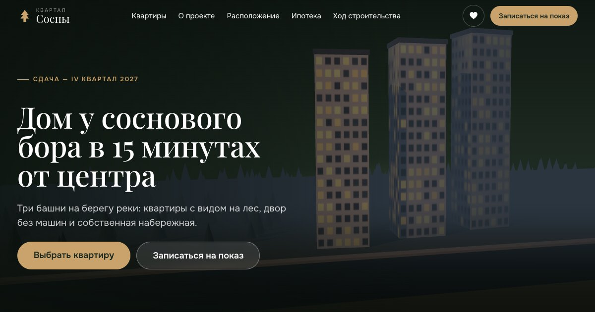

# Квартал «Сосны» — сайт жилого комплекса

Пет-проект: промо-сайт ЖК с подбором квартир. Цены, квартиры и адрес
вымышленные. Собран на шаблоне **frontend-kit** (Astro + TypeScript).



## Что есть

- **3D-квартал на первом экране** (three.js): башни с горящими окнами, сосны,
  река. Камера облетает квартал при прокрутке. Если навести мышь на башню,
  видно, сколько в ней свободных квартир, а клик открывает каталог по этой башне.
  three.js загружается лениво, отдельным файлом. Без WebGL остаётся CSS-фон.
- **Каталог** (`/flats/`): 270 квартир. Есть фильтры по комнатам, цене,
  площади, этажу, башне и отделке, а также сортировка. Два вида — **список** и
  **шахматка**. Фильтры и выбранная вкладка хранятся в адресе, так что ссылкой
  можно поделиться.
- **Страница каждой квартиры** (`/flats/2-10-4/`): 270 статических HTML-страниц
  для поисковиков. На каждой есть SVG-планировка, параметры, схема этажа,
  ипотечный калькулятор с ценой этой квартиры и похожие квартиры.
- **Избранное** (♥): хранится в браузере, синхронизируется между вкладками,
  счётчик показан в шапке.
- **Ипотечный калькулятор**: семейная, IT, базовая программа и рассрочка.
- **Запись на показ**: модалка, которая открывается и по ссылке `#visit`.
  Есть маска телефона и валидация. Со страницы квартиры в заявку
  подставляется номер квартиры.
- Анимации: параллакс пейзажа, «стопка» карточек преимуществ, прорисовка
  маршрутов на карте, горизонтальная лента хода строительства.

## Запуск

```bash
npm install
npm run dev        # http://localhost:4321
npm run check      # линтеры + типы + тесты + сборка — перед публикацией
npm run build      # готовый сайт в dist/
```

## Что где менять

| Что                                             | Где                                                            |
| ----------------------------------------------- | -------------------------------------------------------------- |
| Название, адрес, телефон, срок сдачи, слоган    | `src/data/project.ts` → `project`                              |
| Цифры на первом экране (3 башни, 270 квартир…)  | `src/data/project.ts` → `facts`                                |
| Преимущества, ход строительства, места на карте | `src/data/project.ts` → `features`, `progress`, `places`       |
| Ипотечные программы и ставки                    | `src/data/project.ts` → `mortgagePrograms`                     |
| Квартиры (сейчас генерируются)                  | `src/data/flats.ts` → замените `generateFlats()` данными CRM   |
| Планировки (комнаты, окна)                      | `src/lib/plan.ts` → `PLANS`                                    |
| Цвета, шрифты                                   | `src/styles/_abstracts.scss` (+ импорт шрифтов в `Base.astro`) |
| Цвета комнатности в шахматке                    | `src/styles/sections/_catalog.scss` → `--room-0…3`             |
| 3D-сцена (высота башен, цвета, камера)          | `src/modules/building3d/scene.ts`                              |
| Отправка заявки (сейчас демо)                   | `src/scripts/app.ts` → обработчик `form:submit`                |
| Адрес сайта (sitemap, Open Graph)               | `astro.config.mjs` → `site`                                    |
| Картинка для соцсетей                           | `public/og.jpg` (1200×630)                                     |

## Где что лежит

```
src/
  data/        контент и квартиры — правится чаще всего
  lib/         чистые функции: фильтры, ипотека, планировки, карточка (покрыты тестами)
  modules/     свои модули: building3d, catalog, favorites, mortgage
  components/  секции главной, шапка, подвал, модалка
  pages/       главная, /flats/, /flats/[id]/, /favorites/, 404, /plans/*.svg
  styles/      _abstracts (настройки), _layout (общее), sections/ (секции)
  scripts/     app.ts — запуск модулей и схема формы
kit/           общий кит (модули, SCSS, dev-панель) — см. docs/
```

Свой модуль: `src/modules/<имя>/index.ts` и строка в `projectModules` в
`src/scripts/app.ts`. Затем в разметке пишется `data-module="<имя>"`.

## Возможные проблемы

| Симптом                                                 | Причина и решение                                                                                                         |
| ------------------------------------------------------- | ------------------------------------------------------------------------------------------------------------------------- |
| На первом экране нет 3D, только тёмный фон              | Нет WebGL (старое устройство, отключено ускорение) — так и задумано. В консоли ошибка — смотрите `scene.ts`.              |
| Башни под заголовком на широком экране                  | Сдвиг камеры — `setViewOffset` в `scene.ts` → `resize()` (доля `0.2`).                                                    |
| Фильтр сбрасывает вкладку «Шахматка» после перезагрузки | `toSearch()` должен получать `location.search` третьим аргументом: он сохраняет чужие параметры (`view`). Есть тест.      |
| Ползунки фильтров не совпадают со значениями из адреса  | Значения ставятся после отрисовки (`requestAnimationFrame` в `catalog`). Модуль `range` должен успеть инициализироваться. |
| Избранное не сохраняется                                | Приватный режим или запрет cookies: localStorage недоступен, кит молча это переживает (`kit/js/core/storage.js`).         |
| Сборка предупреждает о большом файле                    | Это three.js (~600 КБ). Он ленивый и грузится только для 3D; порог поднят в `astro.config.mjs`.                           |
| Шапка на главной белая на светлом фоне                  | Прозрачная белая шапка нужна только над тёмным hero (`<Base heroDark>`). На других страницах `heroDark` не передавайте.   |

Общие баги кита (формы, маски, слайдеры, fixed внутри transform…) описаны в
[docs/troubleshooting.md](docs/troubleshooting.md).
